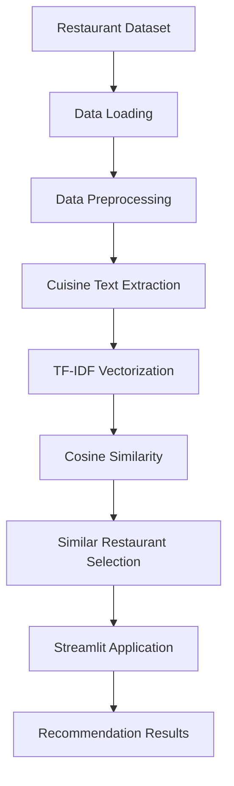
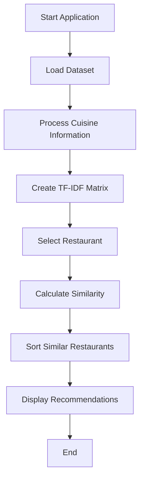
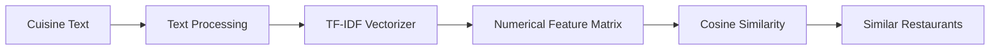

<div align="center">

# 🍽️ Restaurant Recommendation System

### Discover Similar Restaurants Using Machine Learning & Natural Language Processing

A content-based restaurant recommendation system that uses **TF-IDF Vectorization and Cosine Similarity** to recommend restaurants with similar cuisine characteristics.

<br/>


<br/>

**An Internship Project | Machine Learning | NLP | Recommendation Systems**

</div>

---

## 📋 Table of Contents

1. [Overview](#-overview)
2. [Problem Statement](#-problem-statement)
3. [Why This Project?](#-why-this-project)
4. [Features](#-features)
5. [Screenshots](#-screenshots)
6. [System Architecture](#-system-architecture)
7. [Workflow](#-workflow)
8. [NLP Pipeline](#-nlp-pipeline)
9. [Tech Stack](#-tech-stack)
10. [Project Structure](#-project-structure)
11. [Installation](#-installation)
12. [Usage](#-usage)
13. [Future Scope](#-future-scope)
14. [Learning Outcomes](#-learning-outcomes)
15. [Project Highlights](#-project-highlights)
16. [Author](#-author)
17. [License](#-license)
18. [Footer](#-footer)

---

## 📌 Overview

The **Restaurant Recommendation System** is a Machine Learning-based web application developed to recommend restaurants based on cuisine similarity.

The system applies **Natural Language Processing (NLP)** and a **Content-Based Filtering** approach to analyze restaurant cuisine information.

Users can select a restaurant through an interactive Streamlit interface and receive recommendations for restaurants with similar cuisine characteristics.

### 🎯 Main Objective

The primary objective of this project is to demonstrate how text-based restaurant information can be transformed into numerical features and used to generate meaningful restaurant recommendations.

---

## ❓ Problem Statement

With a large number of restaurants available, users may find it difficult to discover restaurants that match their cuisine preferences.

Traditional restaurant searches may require users to manually explore multiple options.

This project addresses the problem by developing a recommendation system that:

- Processes restaurant cuisine information.
- Identifies similarities between restaurants.
- Recommends restaurants based on similar cuisine characteristics.
- Presents results through an easy-to-use web interface.

---

## 💡 Why This Project?

This project was developed to gain practical experience in:

- Recommendation System development.
- Natural Language Processing.
- Text feature extraction.
- Similarity-based Machine Learning techniques.
- Interactive Machine Learning application development.
- Deploying a data-driven workflow through Streamlit.

### Real-World Relevance

Content-based recommendation techniques can be used in food discovery platforms to help users explore restaurants with similar cuisine profiles.

This project demonstrates the fundamental architecture of such a recommendation workflow.

---

## ✨ Features

### 🔍 Restaurant Discovery

- Search and select restaurants through the application.
- Explore restaurants using available restaurant information.

### 🤖 Recommendation Engine

- Content-Based Filtering.
- TF-IDF-based cuisine representation.
- Cosine Similarity-based restaurant comparison.
- Similar restaurant recommendations.

### 📊 Restaurant Information

- Restaurant names.
- Cuisine-related information.
- Additional dataset information displayed by the application.

### 🎨 Interactive Interface

- Streamlit-based user interface.
- Simple restaurant selection workflow.
- Organized recommendation results.
- Easy-to-use application design.

---

## 📸 Screenshots

### 🏠 Home Page

The home page introduces the restaurant recommendation application.


---

### 📊 Dataset Overview

The dataset overview screen displays information related to the restaurant dataset.


---

### 🔎 Search Interface

Users can interact with the search interface to select a restaurant.


---

### 🍽️ Restaurant Recommendations

The application provides restaurant recommendations based on cuisine similarity.


---

### 🍗 Charming Chicken Recommendation

Example of recommendations generated for the selected restaurant.


---

### 🐟 Bubby Fish & Chicken Recommendation

Another example of the recommendation system output.


---

## 🏗️ System Architecture

The project follows a **Content-Based Recommendation Architecture**.



### Architecture Components

| Component | Responsibility |
|---|---|
| Dataset | Provides restaurant information |
| Data Processing | Prepares relevant text data |
| TF-IDF | Converts cuisine text into numerical vectors |
| Cosine Similarity | Measures similarity between restaurant vectors |
| Recommendation Engine | Selects similar restaurants |
| Streamlit | Provides the interactive user interface |

---

## 🔄 Workflow

The recommendation process follows these steps:

1. Load the restaurant dataset.
2. Read and process relevant restaurant information.
3. Extract cuisine-related text features.
4. Apply TF-IDF Vectorization.
5. Generate numerical representations of cuisine information.
6. Calculate Cosine Similarity between restaurants.
7. Identify restaurants with similar cuisine characteristics.
8. Display recommendations through the Streamlit application.

### Workflow Diagram



---

## 🧠 NLP Pipeline

Natural Language Processing is used to process cuisine-related textual information.

### 1. Text Preparation

Relevant cuisine information is selected from the dataset.

### 2. Text Representation

Cuisine information is converted into numerical vectors using TF-IDF.

### 3. Feature Comparison

The generated vectors are compared using Cosine Similarity.

### 4. Recommendation Generation

Restaurants with similar feature representations are selected as recommendations.

### NLP Pipeline Diagram



### Why TF-IDF?

TF-IDF helps represent text by assigning importance to words based on their frequency and distribution within the available text collection.

### Why Cosine Similarity?

Cosine Similarity compares the orientation of numerical vectors, making it useful for identifying similarity between text-based restaurant representations.

---

## 🛠️ Tech Stack

### Programming Language

- **Python**

### Machine Learning & NLP

- **Scikit-learn**
- TF-IDF Vectorization
- Cosine Similarity
- Content-Based Filtering

### Data Processing

- **Pandas**
- **NumPy**

### User Interface

- **Streamlit**

### Development Tools

- Jupyter Notebook
- Visual Studio Code
- Git
- GitHub

---

## 📂 Project Structure

```text
Restaurant-Recommendation-System/
│
├── Output_Screenshort's/
│   ├── home.png
│   ├── dataset-overview.png
│   ├── search-interface.png
│   ├── recommendation-eat-on.png
│   ├── recommendation-charming-chicken.png
│   └── recommendation-bubby-fish-chicken.png
│
├── app_task2.py
├── Dataset.csv
├── Task2.ipynb
├── requirements.txt
└── README.md
```

> **Note:** The screenshot filenames above should match the actual filenames in your repository.

---

## ⚙️ Installation

Follow these steps to run the project locally.

### 1. Clone the Repository

```bash
git clone https://github.com/Arjit-Bhadouria/Restaurant-Recommendation-System.git
```

### 2. Navigate to the Project Directory

```bash
cd Restaurant-Recommendation-System
```

### 3. Create a Virtual Environment

#### Windows

```bash
python -m venv venv
```

Activate the environment:

```bash
venv\Scripts\activate
```

#### macOS / Linux

```bash
python3 -m venv venv
```

Activate the environment:

```bash
source venv/bin/activate
```

### 4. Install Dependencies

```bash
pip install -r requirements.txt
```

---

## ▶️ Usage

### 1. Start the Streamlit Application

Run the following command:

```bash
streamlit run app_task2.py
```

### 2. Open the Application

After running the command, Streamlit will provide a local URL in the terminal.

Open the URL in your web browser.

### 3. Generate Recommendations

1. Open the application.
2. Select or search for a restaurant.
3. Allow the system to process the selected restaurant.
4. View the recommended restaurants.
5. Explore the displayed restaurant information.

---

## 🚀 Future Scope

The project can be further improved through the following enhancements:

### 👤 Personalized Recommendations

Develop user-specific recommendations using preferences, ratings, and previous interactions.

### 📍 Location-Based Filtering

Allow users to filter restaurants based on city, location, or distance.

### 💰 Budget-Based Filtering

Add price-range filters to help users discover restaurants within their budget.

### ⭐ Rating Integration

Incorporate restaurant ratings into the recommendation ranking.

### 🗺️ Map Integration

Integrate mapping services to display restaurant locations.

### 🌐 Deployment

Deploy the application on a cloud platform for public access.

### 🤝 Hybrid Recommendation System

Combine content-based filtering with collaborative filtering to develop a hybrid recommendation approach.

---

## 📚 Learning Outcomes

This project provided practical experience in:

- Understanding recommendation system fundamentals.
- Implementing Content-Based Filtering.
- Applying TF-IDF Vectorization.
- Using Cosine Similarity for text comparison.
- Performing data processing with Pandas.
- Working with Machine Learning libraries.
- Building interactive applications with Streamlit.
- Organizing a Machine Learning project.
- Managing source code using Git and GitHub.
- Documenting a technical project professionally.

---

## 🌟 Project Highlights

| Area | Implementation |
|---|---|
| Project Type | Machine Learning Application |
| Recommendation Approach | Content-Based Filtering |
| Text Processing | TF-IDF Vectorization |
| Similarity Technique | Cosine Similarity |
| Interface | Streamlit Web Application |
| Development | Python |
| Project Documentation | GitHub README |

### Key Technical Concept

The project demonstrates how textual restaurant information can be transformed into numerical representations and compared to generate similarity-based recommendations.

---

## 👨‍💻 Author

<div align="center">

### Arjit Bhadouria

**B.Tech Computer Science Engineering**  
**Specialization: Artificial Intelligence & Machine Learning**

Machine Learning Engineer

<br/>

<a href="https://github.com/Arjit-Bhadouria">
  
</a>

</div>

---

## ⭐ Footer

<div align="center">

### 🍽️ Explore. Discover. Recommend.

Thank you for visiting the Restaurant Recommendation System repository!

If you found this project useful or interesting, consider giving it a ⭐ on GitHub.

<br/>

**Built with Python, Machine Learning, NLP, and Streamlit.**

</div>
